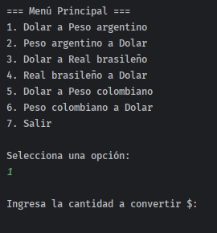
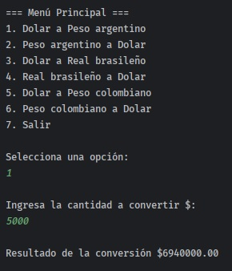

# Conversor de Monedas
## _Programa para la conversion de monedas_

Esto es un programa que realiza la conversion de monedas de diferentes paises, utilizando los datos de una API

## Funcionalidad
- Se mostrara un menu de opciones para la converion entre distintas monedas
- El usuario debera elegir una de estas opciones
- Luego ingresara el valor que desea convertir
- El programa le mostrara un resultado con el valor equivalente a la moneda que deseaba convertir
- Luego volvera al menu de opciones y podra seguir realizando conversiones las veces que desea o podra elegir la opcion para salir y terminar la ejecucion del programa

## Capturas del proyecto
### Menu de opciones

### Ingresando una opcion

### Ingresando el valor que desea convertir

### Mostrando el resultado de la moneda convertida

### Saliendo del programa

## Tecnologias

Las tecnologias principales que se usaron para el proyecto fueron:

- Java 17
- API
- Gson
- Intellij IDE

## Pasos a seguir
- Modificar el mensaje del resultado
- Historial de Conversiones: Agrega la capacidad de rastrear y mostrar el historial de las últimas conversiones realizadas, brindando a los usuarios una visión completa de sus actividades.
- Soporte para Más Monedas: Amplía la lista de monedas disponibles para la elección, permitiendo a los usuarios convertir entre una variedad aún mayor de opciones monetarias.
- Registros con Marca de Tiempo: Utiliza las funciones de la biblioteca java.time para crear registros que registren las conversiones realizadas, incluyendo información sobre qué monedas se convirtieron y en qué momento.

y como siempre en el desarrollo de software hay que seguir refactorizando, mejorando y agregando nuevas funciones a la aplicacion.

